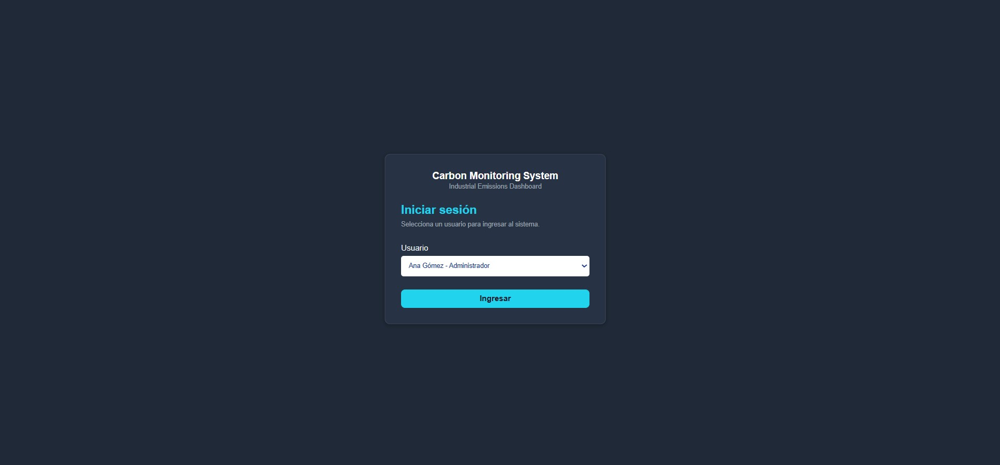
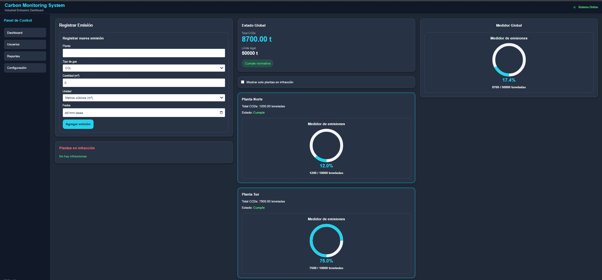

# Sistema de Monitoreo de Emisiones y Huellas de Carbono (Oil & Gas)

## Descripción

El Sistema de Monitoreo de Emisiones y Huellas de Carbono es una aplicación web desarrollada con Vue 3 y TypeScript orientada al seguimiento y control de emisiones industriales en el sector Oil & Gas.

La aplicación permite registrar emisiones de diferentes gases de efecto invernadero, convertir automáticamente los valores a CO₂ equivalente (CO₂e), visualizar métricas globales, monitorear plantas industriales, detectar infracciones respecto de los límites establecidos y gestionar usuarios del sistema.

El proyecto fue desarrollado como Trabajo Práctico Integrador aplicando conceptos de desarrollo Frontend moderno, componentes reutilizables, tipado estático, gestión de estado local y navegación mediante Vue Router.

---
# Sistema de Monitoreo de Emisiones y Huellas de Carbono (Oil & Gas)

## Descripción

... descripción del proyecto ...

---

## Capturas de Pantalla

### Pantalla de Inicio de Sesión



### Dashboard Principal



---

## Objetivos

... objetivos ...

---

## Tecnologías Utilizadas

...
---

## Objetivos

* Registrar emisiones industriales de diferentes gases.
* Convertir emisiones a CO₂ equivalente (CO₂e).
* Monitorear el estado ambiental de múltiples plantas.
* Detectar automáticamente plantas en infracción.
* Visualizar métricas globales mediante indicadores gráficos.
* Gestionar usuarios del sistema.
* Implementar navegación mediante Vue Router.
* Aplicar buenas prácticas de desarrollo con TypeScript.

---

## Tecnologías Utilizadas

### Frontend

* Vue 3
* TypeScript
* Vue Router
* Tailwind CSS
* Vite

### Control de versiones

* Git
* GitHub

---

## Funcionalidades Implementadas

### Login Simulado

* Selección de usuario.
* Acceso al sistema mediante botón "Ingresar".
* Redirección al Dashboard principal.

### Gestión de Emisiones

* Registro de emisiones.
* Selección de tipo de gas.
* Conversión automática a CO₂e.
* Conversión de unidades métricas.
* Validación de datos ingresados.

### Dashboard Ambiental

* Visualización del total global de emisiones.
* Comparación contra límites legales.
* Indicador de cumplimiento normativo.
* Medidor gráfico de emisiones.

### Monitoreo de Plantas

* Resumen de emisiones por planta.
* Cálculo automático de emisiones acumuladas.
* Visualización de estado:

  * Cumple normativa.
  * En infracción.
* Alertas visuales dinámicas mediante clases CSS reactivas.

### Reportes

* Vista preparada para exportación de reportes PDF.
* Reportes individuales por planta.
* Reporte global del sistema.

### Configuración

* Vista preparada para administración de parámetros del sistema.
* Configuración de límites legales.
* Configuración de límites por planta.

### Gestión de Usuarios

* Listado de usuarios.
* Alta de usuarios.
* Visualización de detalle.
* Edición de usuarios.
* Navegación mediante rutas dinámicas.

---

## Conversión de Emisiones

Factores utilizados para convertir emisiones a CO₂ equivalente:

| Gas | Factor CO₂e |
| --- | ----------- |
| CO₂ | 1           |
| CH₄ | 25          |
| NOx | 298         |

---

## Rutas Disponibles

| Ruta            | Descripción               |
| --------------- | ------------------------- |
| /login          | Inicio de sesión simulado |
| /dashboard      | Dashboard principal       |
| /users          | Gestión de usuarios       |
| /users/create   | Alta de usuario           |
| /users/:id      | Detalle de usuario        |
| /users/:id/edit | Edición de usuario        |
| /reportes       | Reportes                  |
| /configuracion  | Configuración             |

---

## Estructura del Proyecto

```text
src/
│
├── assets/
├── charts/
│   └── GaugeMeter.vue
│
├── components/
│   ├── CarbonDashboard.vue
│   ├── EmissionForm.vue
│   └── FacilityCard.vue
│
├── interfaces/
│   ├── EmissionLog.ts
│   └── User.ts
│
├── router/
│   └── index.ts
│
├── views/
│   ├── Login.vue
│   ├── Home.vue
│   ├── Reportes.vue
│   ├── Configuracion.vue
│   └── users/
│       ├── UserList.vue
│       ├── UserCreate.vue
│       ├── UserDetail.vue
│       └── UserEdit.vue
│
├── App.vue
└── main.ts
```

---

## Instalación

Clonar repositorio:

```bash
git clone <URL_DEL_REPOSITORIO>
```

Ingresar al proyecto:

```bash
cd monitoreo_emisiones_huella
```

Instalar dependencias:

```bash
npm install
```

---

## Ejecución

Iniciar servidor de desarrollo:

```bash
npm run dev
```

La aplicación quedará disponible en:

```text
http://localhost:5173
```

---

## Flujo de Desarrollo

El proyecto fue desarrollado utilizando una estrategia de ramas por funcionalidad.

### Ramas principales utilizadas

```text
main
feature/logica-metricas-calculos
feature/router
feature/users-module
feature/login-simulation
```

Cada rama incorporó funcionalidades específicas que posteriormente fueron integradas al sistema principal.

---

## Posibles Mejoras Futuras

* Persistencia de datos mediante Backend y Base de Datos.
* Generación real de reportes PDF.
* Autenticación con JWT.
* Control de permisos por rol.
* Persistencia de usuarios.
* Integración con APIs ambientales.
* Exportación de datos a Excel.
* Dashboard analítico avanzado.

---

## Autor

Florencia Llosa Vernaya

---

## Estado del Proyecto

Proyecto académico finalizado y funcional.
Implementa monitoreo de emisiones, gestión de usuarios, navegación mediante Vue Router y visualización de métricas ambientales para el sector Oil & Gas.
